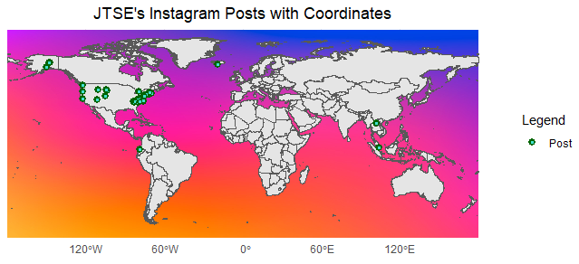

# 30daysmaps2023

This is my contribution to the #30DayMapChallenge for November 2023.\
About the #30DayMapChallenge , check out <https://30daymapchallenge.com/> !

## Introduction

### About me

I am a postgraduate student current undertaking a MSc in Urban Spatial Science at UCL (expected graduation = August 2024). \
My background is in geography/geographic information systems/remote sensing. My Bachelor's was a Joint-Degree between the National University of Singapore and University of North Carolina-Chapel Hill. \
My other interests include hiking, drone piloting/photogrpahy and board games.

### Day 10: North America

### Day 9: Hexagons

### Day 8: Africa

### Day 7: Navigation

### Day 6: Asia

### Day 5: Analog Map

### Day 4: A bad map

### Day 3: Polygon

### Day 2: Lines

### Day 1: Points

I accessed and downloaded my Instagram Post data (refer to https://lnkd.in/eabi6Nz8 on how to get your own data & screenshot for how the data looks like. Only posts which were geotagged will have coordinates). 

I subsequently extracted out the coordinates of my posts before plotting the points and setting the background to Instagram's colour scheme. From the map, most of the points are concentrated in Singapore (home) and US (where I spent a year abroad). 

Given that there is more attention to the replicability of research, I will also be sharing the code I use and most of the datasets (except when it involves data privacy).
