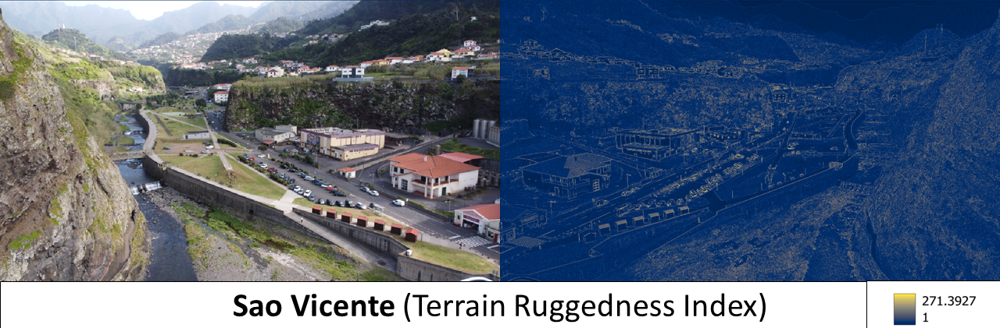

# 30daysmaps2023

This is my contribution to the #30DayMapChallenge for November 2023.\
About the #30DayMapChallenge , check out <https://30daymapchallenge.com/> !

## Introduction

### About me

I am a postgraduate student current undertaking a MSc in Urban Spatial Science at UCL (expected graduation = August 2024). \
My background is in geography/geographic information systems/remote sensing. My Bachelor's was a Joint-Degree between the National University of Singapore and University of North Carolina-Chapel Hill. \
My other interests include hiking, drone piloting/photogrpahy and board games.

### Day 24: Black and White

celand is such a scenic location with glaciers, geologic formations, the Northern Lights and whales. Converted an elevation raster from OpenTopography into its contour lines. The black and white layout kind of reinforces the impression that Iceland is covered completely by ice when it is only permanently so by 11% according to [National Geographic](https://www.nationalgeographic.com/science/article/iceland-greenland-name-swap) 

Population Spike Tutorial: [Rayshader Tutorial—Florida Population Density](https://www.youtube.com/watch?v=zgFXVhmKNbU&ab_channel=SpencerSchien) \
Data Source: [OpenTopography](https://portal.opentopography.org/datasets)

### Day 23: 3D

Finally managed to include a map of North Carolina, my first home away from home back in 2016/2017. For this challenge, I followed a tutorial to make a population spike map. The most time consuming portion was the st_intersection to carve out North Carolina from the entire US data but the results were definitely worth it. Also quite impressed by the data provided by Kontur Inc. which has a spatial resolution of 400m for the entire US.

Population Spike Tutorial: [Rayshader Tutorial—Florida Population Density](https://www.youtube.com/watch?v=zgFXVhmKNbU&ab_channel=SpencerSchien) \
Data Source: [Kontur - USA](https://data.humdata.org/dataset/kontur-population-united-states-of-america) ; [Kontur - Japan](https://data.humdata.org/dataset/kontur-population-japan)

### Day 22: North is not always up

This theme was a bit less straightforward to interpret and I was thinking of 1) just flipping the map 180 degrees (but that would be very lazy), 2) Spilhaus Projection (but not supported in QGIS or Rstudio) or 3) Plotting places called North (only found two: one in South Carolina, US and the other in Nigeria). In the end, went for plotting the global north-south divide which doesn't really divide the world into neat halves, among other criticisms. Added in the Human Development Index 2019 (also not without its flaws) to see holistically how countries are performing in recent years.

Data Source: [ArcGIS Hub](https://hub.arcgis.com/datasets/93b4764f3b3f4b7bb31feaf50499b56f/explore)

### Day 21: Raster

I was looking forward to it to use some of the drone images I took in the last year. However, encountered some roadblocks in doing more meaningful classifications or analysis (something to do with requiring x number of images with overlaps in the same area and bands). As such, I could just do a Terrain Ruggedness Index at the moment. Do enjoy the drone images shot on Dji Mini 2 (Sao Vicente and Pular Besar) and Dji Mini 3 Pro (Seven Sisters) though :)

Data Source: Author's own

### Day 20: Outdoors

The US National Parks never fail to take my breath away with their majestic landscapes and fascinating wildlife. For this challenge, I decided to make a timelapse of Crater Lake. In January 2017, I attempted to visit but was blocked by snow and I returned in summer/May 2017 (top-right). To make the timelapse, I experimented with Sentinel Hub and selected Sentinel-2 as the data source. The intervals between each image was quite short and the interface was really easy to navigate. I set a Minimum Tile Coverage of 10% and Maximum Cloud Cover of 70%, along with filtering out some extra images before exporting out the final output.

Data Source: [Sentinel Hub](https://www.sentinel-hub.com/)

### Day 19: 5 Minute Map

Well I exceeded the time with a total of 6 minutes 5 seconds to find the data, open QGIS, adjust the symbology and export the file. In order to make a 5 minute map, one really needs to have a clear idea of what they want to plot, and being familiar with the availability and type of data. As such, I chose to do a map of Singapore. The map below shows the distribution of lamp posts around the island which makes it one of the safest places to walk at 2am (besides other factors).

Data Source: [LTA Data Mall](https://datamall.lta.gov.sg/content/datamall/en/static-data.html)

### Day 18: Atmosphere

For Day 18 of #30DayMapChallenge with the theme of atmosphere, decided to work with one of the datasets used in my GIS module. This map shows an animation of the projected monthly average maximum temperature for 2081-2100, under the assumption of the ssp370 scenario (Regional Rivalry – A Rocky Road (High challenges to mitigation and adaptation)). There were 5 different scenarios defined under the IPCC Sixth Assessment Report in 2021. [CarbonBrief](https://www.carbonbrief.org/explainer-how-shared-socioeconomic-pathways-explore-future-climate-change/) provides a good summary on the narratives and implications.

Data Source: [WorldClim](https://www.worldclim.org/data/cmip6/cmip6_clim2.5m.html) (Note: Besides maximum temperature, other variables such as minimum temperature, precipitation and bioclimates are available)

### Day 17: Flow

What better way to represent flows than rivers? Okay others could debate ocean currents or jet streams too. Decided to plot the rivers of South America with the line thickness and shade becoming more intense with increasing Strahler number. Although the Amazon is considered a twelfth order waterway, the dataset classifies the rivers from first to eighth orders (possibly due to methodology). I couldn't decide if a black or white background had better aesthetics hence I decided to design with both.

Data Source: [Food and Agriculture Organization](https://data.apps.fao.org/catalog/iso/12d7d96a-b0ea-4aea-aedc-b9c9a80cab7f)

### Day 16: Oceania

For today's map, stitched three maps together to capture the full boundary (zoomed in) and some of the features located in the Great Barrier Reef Marine Park

Data Source: [Great Barrier Reef Marine Park Features](https://data.gov.au/data/dataset/great-barrier-reef-marine-park-features) ; [Great Barrier Reef Marine Park Boundary](https://geoportal.gbrmpa.gov.au/maps/68d92e6e49fa4fd59b66e22f5c45156c) \
Picture Source: [Turtle](https://unsplash.com/photos/white-and-black-sea-turtle-under-water-TLxTFr9AoO0), [Shark](https://pixabay.com/photos/shark-great-barrier-reef-underwater-2683184/), [Coral Reefs](https://unsplash.com/photos/an-aerial-view-of-a-coral-reef-in-the-ocean-k4XDVl-JCpQ)

### Day 15: OpenStreetMaps

15th November marks the halfway mark of this endeavour and it has been inspiring seeing the various techniques, tools and visualisations crafted by other professionals. It is also GIS Day so wishing all in continuing to inspire the world with GIS and developing new ways of exploring our world.

Not only that but 15th November is also Steve Irwin Day. To honour The Crocodile Hunter, I have clipped an OSM basemap of the Gold Coast (including the Australia Zoo) in the shape of the crocodile.

### Day 14: Europe

Made a leaflet map (https://jamestansongen.github.io/London_Cultural_Infrastructure/) where you can change basemap and filter different categories of London Cultural Infrastructure. The original data source has 35 categories but I added in only 5 categories. The code is available to replicate the workflow and add more categories if one wishes to.

Data Source: [Cultural Infrastructure Data Points](https://data.london.gov.uk/dataset/cultural-infrastructure-map)

### Day 13: Chloropleth

Was combing through 'Our World in Data' to decide which two datasets were similar in timeframe and topic to make this bivariate map.

Bivariate Tutorial: [Bivariate choropleth maps in QGIS](https://bnhr.xyz/2019/09/15/bivariate-choropleths-in-qgis.html) \
Data Source: [Endemic Bird Species 2020](https://ourworldindata.org/grapher/endemic-bird-species-by-country) ; [Endemic Mammal Species 2020](https://ourworldindata.org/grapher/endemic-mammal-species-by-country)

### Day 12: South America

During my time at UNC-Chapel Hill, I had the opportunity to take a module dedicated solely to the Galapagos Islands. The islands, known for their unique and diverse ecosystems, played a pivotal role in shaping our understanding of evolution, as famously observed by Charles Darwin. The physical environment of the Galapagos provides an intriguing backdrop for studying geological processes and ecological diversity. On the other hand, examining the human environment on the islands allows us to examine the delicate balance between conservation efforts and sustainable development. Hoping to eventually get the opportunity to visit the Islands someday!

Data Source: [OpenGeoData FCD](https://geodata-fcdgps.opendata.arcgis.com/datasets/fcdgps::curvas-de-nivel-30m/explore) \
Image 1: [Iguna](https://pixabay.com/photos/iguana-galapagos-reptile-nature-894465/) \
Image 2: [Turtle](https://pixabay.com/photos/turtle-huge-the-galapagos-islands-4205792/) \
Image 3: [Albatross](https://unsplash.com/photos/white-and-black-bird-on-brown-stick-during-daytime-50Joxuqtp3s)

### Day 11: Retro

Was inspired by 1980s/1990s Japanese City Pop to make a neon map of Japan. Selected/exported groups of polylines from the boundary and changed each of their colour and glow to create the vibes.

Data Source: [Geospatial Information Authority of Japan](https://www.gsi.go.jp/kankyochiri/gm_japan_e.html)

### Day 10: North America

I decided to make a heatmap of UFO sightings in 2016 🛸. The interactive map can be accessed at [UFO 2016 Sightings](https://lnkd.in/gDHwu6P8) 

Data Source: [kaggle](https://www.kaggle.com/datasets/utkarshx27/ufo-sights-2016-us-and-canada/)

### Day 9: Hexagons

I generated a hexagon map followed by a count of points in polygon in QGIS. The maps are informative in showing the distribution and number of outlets for various chains across the US.

Data Source: [Esri](https://hub.arcgis.com/maps/f12d05c1b4054fffa34f4ae8e7599f17)

### Day 8: Africa

Decided to follow [Helen McKenzie's](https://www.helenmakesmaps.com/post/how-to-joy-plot) tutorial on making a joy plot/ The tutorial was easy to follow and the output was really satisfying.

I made a joy plot of Cape Town, South Africa as it was the first African city I visited back in 2003. Table Mountain with an elevation of 1086m (bottom left) offers a breathtaking panorama of the city and it is home to adorable dassies (or rock hyrax). I would definitely recommend visiting!

Joyplot Tutorial: [How to make a joy-plot](https://www.helenmakesmaps.com/post/how-to-joy-plot) \
Data Source: [USGS](https://earthexplorer.usgs.gov/)

### Day 7: Navigation

"Suspended between sea and sky, battered by the waves and the wind, lighthouses mark the battle lines between the elements. They guard the boundaries between the solid human world and the primordial chaos of the waters; between stability and instability; between the known and the unknown." - Where Light in Darkness Lies: The Story of the Lighthouse (Veronica della Dora, 2022)

Data Source: [Edinburgh DataShare](https://datashare.ed.ac.uk/handle/10283/2425?show=full) 

### Day 6: Asia

I decided to choose Singapore, my home, for the theme and the maps were designed according to some of the conversations I had with other people (including Singaporeans) after moving to London. The captions are not meant to take a shot at anyone but present the conversations in a humourous way. Do take the maps with a pinch of salt. The font used is called Singapore Sling which is a gin-based sling cocktail.

Data Source: [data.gov.sg](https://beta.data.gov.sg/collections/1621/datasets/d_142fd1a4da4e367a1a8323613af2f272/view), [GADM](https://gadm.org/download_country.html)

### Day 5: Analog Map

Drew various maps by hand, based on the Pokemon series.

While I lack the artistic talent, I would recommend looking up King of Maps, a map shop in Cusco, Peru. Their hand-drawn maps are hands down some of the most aesthetically pleasing and detailed maps I seen. I also appreciate how there is greater South American representation in their maps.

Data Source: Nintendo

### Day 4: A bad map

What makes a bad map? Is it the absence of good analysis and/or good visualisation?. Overall, poor analysis with good visualisation is probably more dangerous.

The map below is a mashup of random datasets I could find. Visually it is repulsive and I do not think much useful insights could be gleam from it.

Data Source: Numerous Sources

### Day 3: Polygon

Using data from The Food and Agriculture Organization of the United Nations, I extracted the most consumed starch in each country for 2021. 

I then plotted two versions: a normal one and one where the polygons are filled with images of starches.

Data Source: [Food and Agriculture Organization](https://www.fao.org/faostat/en/#data/FBS)

### Day 2: Lines

Extracted a hiking route from AllTrails and convert all the points into a polyline. I then georeference the file in QGIS against a basemap. The line changes colour with elevation which shows how the final push to the submit will be the most intense. I chose Snowdon as it is a hike I hope to conquer in my time here as well.

Data Source: [AllTrails](https://www.alltrails.com/en-gb/explore/trail/wales/gwynedd/yr-wyddfa-snowdon-via-miner-s-track-and-pyg-circular)

### Day 1: Points

I accessed and downloaded my Instagram Post data (refer to https://lnkd.in/eabi6Nz8 on how to get your own data & screenshot for how the data looks like. Only posts which were geotagged will have coordinates). 

I subsequently extracted out the coordinates of my posts before plotting the points and setting the background to Instagram's colour scheme. From the map, most of the points are concentrated in Singapore (home) and US (where I spent a year abroad). 

Given that there is more attention to the replicability of research, I will also be sharing the code I use and most of the datasets (except when it involves data privacy).

Data Source: Author's own
